```{r setup, include=FALSE}
knitr::opts_chunk$set(echo = TRUE)
```


```{r pressure, echo=FALSE, out.width = '10%'}

```


**¿Qué es R?**

R es un proyecto de software libre de GNU y se podría definir desde dos puntos de vista, por una parte, es un    lenguaje de programación y por otra un entorno de trabajo, estando ambos orientados al cálculo estadístico y a
la generación de gráficas.

Como lenguaje de programación proporciona una amplia variedad de técnicas y recursos para el trabajo con gráficas y análisis estadístico y, a su vez, es altamente ampliable. Cuenta con una comunidad extensa de desarrolladores, investigadores y usuarios. Se distribuye con licencia GNU GPL v2 y está disponible para distintos sistemas operativos de tipo Unix y similares (FreeBSD y Linux), Windows y Mac OS.
Como entorno de trabajo se entiende como un sistema totalmente planificado y coherente y no una acumulación incremental de herramientas muy específicas y poco flexibles, como es frecuentemente el caso con otro software de análisis de datos. En este caso el entorno de trabajo R nos proporciona una serie de utilidades para manipulación de datos, cálculo y representación gráfica.


**¿Qué es RStudio?**
RStudio es un entorno de desarrollo integrado (IDE) para R. Es software libre con licencia GPLv3 y se puede ejecutar sobre distintas plataformas (Windows, Mac, o Linux) o incluso desde la web usando RStudio Server.
Instalación de R y RStudio (en Windows).

**Instalar R** para ello descargamos del  sitio oficial de R la última revisión estable, la 2.15.0, pulsando en  Windows (en mi caso) y después pulsando en base y de ahí nos bajamos R-2.15.0-win.exe. Haciendo doble click sobre el fichero comenzamos la instalación. Saldrá el típico aviso de Windows de que no se puede comprobar el editor, no le hacemos caso y pulsamos en ejecutar. A veces también sale otra ventana indicando que hay que permitir la ejecución del paquete ya que requiere privilegios de administrador.

<center>

```{r image1, echo=FALSE, out.width = '50%'}
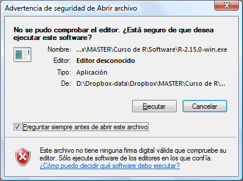
```

</center>

Después solicita el idioma de instalación

<center>

```{r image2, echo=FALSE, out.width = '50%'}
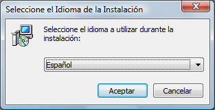
```

</center>

A continuación, arranca el Asistente de instalación, pulsar siguiente.

<center>

```{r image3, echo=FALSE, out.width = '50%'}
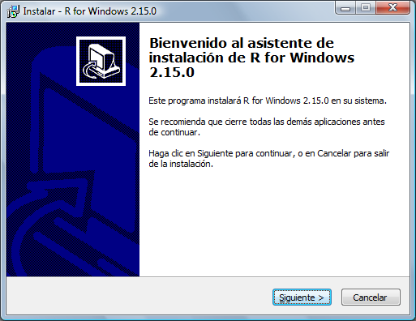
```

</center>

Después informa sobre el tipo de licencia, pulsar siguiente.

<center>

```{r image4, echo=FALSE, out.width = '50%'}
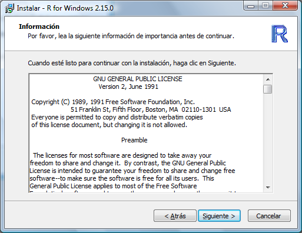
```

</center>

A continuación, nos indica la ruta de instalación, pulsar siguiente.

<center>

```{r image5, echo=FALSE, out.width = '50%'}
knitr::include_graphics("Resources/5.png")
```

</center>

Ahora seleccionamos los paquetes a instalar, pulsar siguiente.

<center>

```{r image6, echo=FALSE, out.width = '50%'}
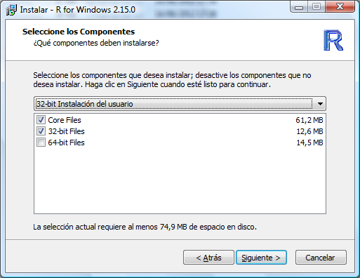
```

</center>

Después nos pregunta si queremos usar las opciones de configuración o no, por defecto aparece no y aquí tampoco nos vamos a complicar demasiado, pulsar siguiente.

<center>

```{r image7, echo=FALSE, out.width = '50%'}
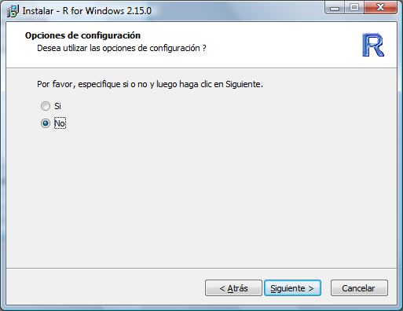
```

</center>

Elegir la carpeta del menú inicio donde colocar los accesos directos a los elementos del paquete, pulsar siguiente.

<center>

```{r image8, echo=FALSE, out.width = '50%'}
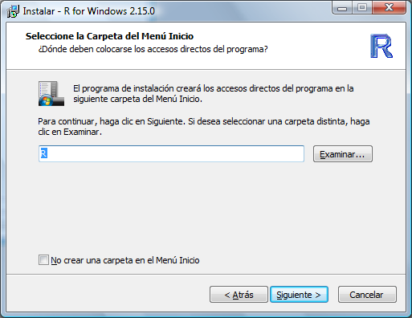
```

</center>

Selección de las tareas adicionales: crear icono en el escritorio, …, pulsar siguiente.

<center>

```{r image9, echo=FALSE, out.width = '50%'}
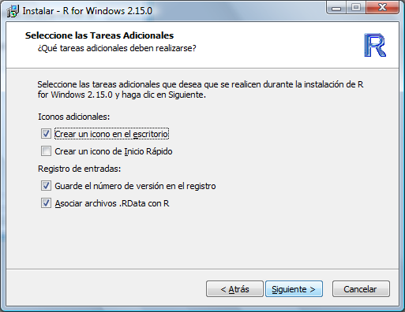
```

</center>

En este preciso instante se inicia el desempaquetado e instalación de la aplicación que tardará muy poco, en mi caso uno 50 segundos aproximadamente.


<center>

```{r image10, echo=FALSE, out.width = '50%'}
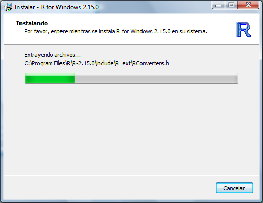
```

</center>

Una vez finalizada el proceso de instalación sale una ventana indicándolo. Pulsar Finalizar.

<center>

```{r image11, echo=FALSE, out.width = '50%'}
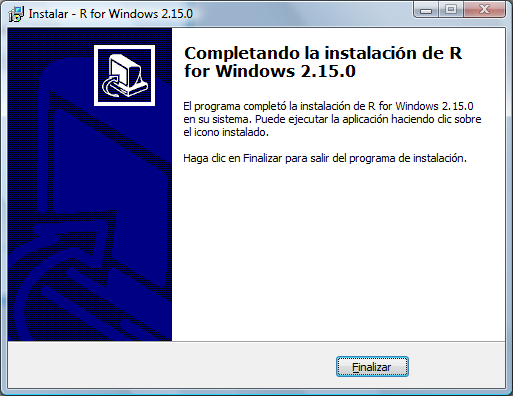
```

</center>

Ya nos aparecerá el correspondiente icono en el escritorio.

<center>

```{r image12, echo=FALSE, out.width = '50%'}
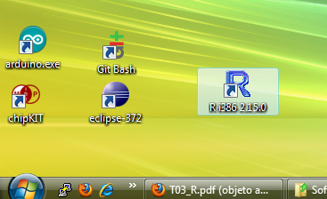
```

</center>

Arrancar el entorno.

<center>

```{r image13, echo=FALSE, out.width = '50%'}
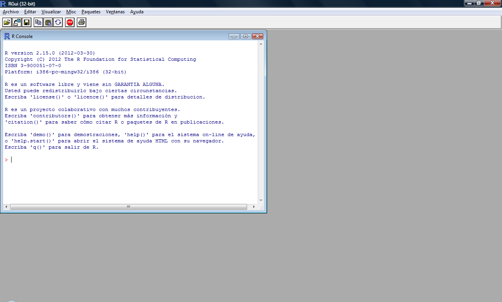
```

</center>

<center>
```{r linea1, echo=FALSE, out.width = '20%', out.height= '500%'}

```
</center>

**Instalar RStudio**, para ello descargo la última versión estable (0,96 en estos momentos) del sitio oficial de RStudio. En mi caso he descargado RStudio-0.96.304.exe para Windows, si tenemos R corriendo en un servidor Linux, existe una versión para instalarla en dicho servidor y ejecutarla desde un navegador web que no voy a describir en estos momentos.
Comienzo ejecutando el instalador anteriormente descargado y, como en el caso anterior, nos volverá a salir el típico aviso de Windows de que no se puede comprobar el editor, no le hacemos caso y pulsamos en ejecutar. A veces también sale otra ventana indicando que hay que permitir la ejecución del paquete ya que requiere privilegios de administrador.

<center>

```{r image14, echo=FALSE, out.width = '50%'}
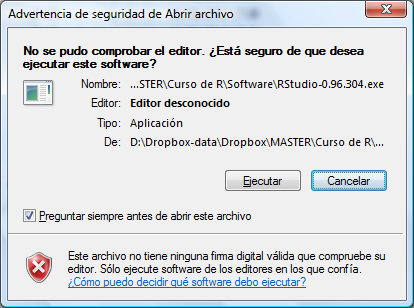
```

</center>

A continuación, aparece el Asistente de instalación, pulsar siguiente.

<center>

```{r image15, echo=FALSE, out.width = '50%'}
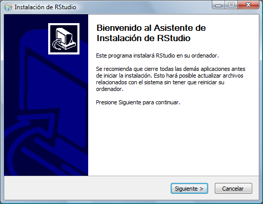
```

</center>

Después nos pide el lugar de instalación del paquete, pulsar siguiente.

<center>

```{r image16, echo=FALSE, out.width = '50%'}
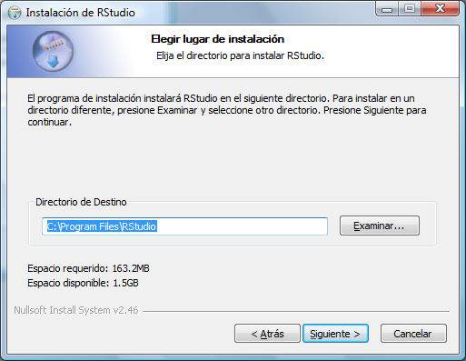
```

</center>

Elegir la carpeta del menú inicio donde colocar los accesos directos a los elementos del paquete, pulsar Instalar.

<center>

```{r image17, echo=FALSE, out.width = '50%'}
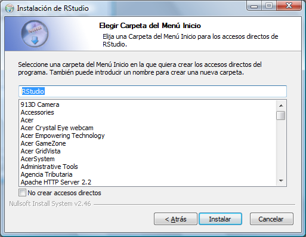
```

</center>


Y comienza la instalación que dura menos de un minuto (El tiempo puede variar dependiendo de la velocdad de la conexion a la red WIFI ).

<center>

```{r image18, echo=FALSE, out.width = '50%'}
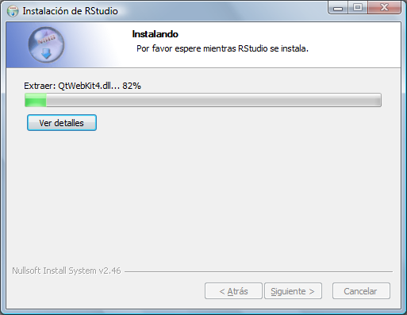
```

</center>

Para finalizar aparece el asistente indicando que ha finalizado la instalación. Pulsar Terminar.

<center>

```{r image19, echo=FALSE, out.width = '50%'}
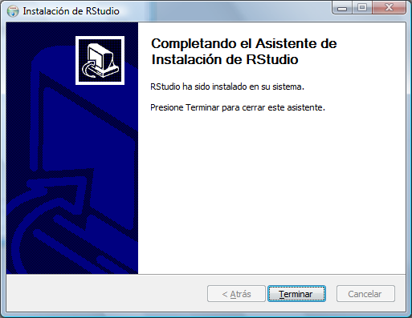
```

</center>

Como no marqué la opción de Accesos directos tres pantallas más atrás me he tenido que crear a mano el acceso en el escritorio, pero ese no es un asunto de este post. Quedando como sigue.

<center>

```{r image20, echo=FALSE, out.width = '50%'}
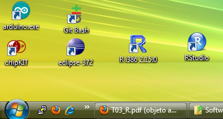
```

</center>

Al arrancar RStudio nos aparece lo siguiente:

<center>

```{r image21, echo=FALSE, out.width = '50%'}
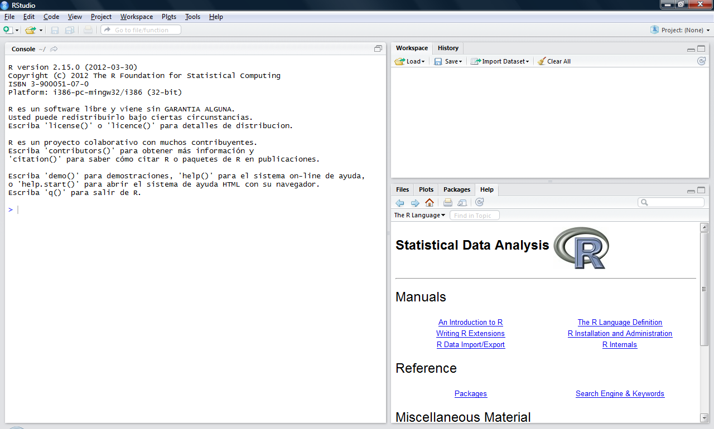
```

</center>

Como podemos ver y si no queremos complicarnos mucho, esta es una típica instalación en Windows del tipo siguiente, siguiente, siguiente.

<center>

```{r next, echo=FALSE, out.width = '50%'}

```

</center>

**Publicar proyectos de R Shiny** *en shinyapps.io*
*https://www.shinyapps.io/*


**Publicar proyectos de R Markdown** *en GotHub*

Publicar website hecho de R en Github

rmarkdown::rendersite() un website (file html) usando la function rmarkdown::rendersite() en R. Funciona muy bien, pero es solo un file html.


En resumen, aquí hay una forma:

    Crea un file html
    Crear docs/ directory
    Vaya a la configuration y habilite el directory docs/ .
    Coloque el file allí en docs/ . Estás listo.

Un ejemplo es, esta página web correspondiente a este file basado en este directory de viñetas .

Mover los files es simple también; podrías usar Travis u otros medios. Un enfoque anterior usaba una twig separada gh-pages , pero la forma actual es más simple.

    Uso de 'git pull' frente a 'git checkout -f' para la implementación del website
    Implementación de Laravel con Git
    ¿Cómo se manejan los files excluidos con aspnet_compiler?
    implementar website desde el control de la versión - exportar y enlaces simbólicos?
    Git: implementa versiones de testing y producción de aplicaciones web en diferentes serveres
    Despliegue automático de github para sitios web estáticos
    Cómo actualizar un website (git deploy) manteniendo el tree de trabajo 'sucio'
    python manage.py collectstatic - error de input al implementar el proyecto Django en Heroku
    Autodeploy con git
    No se puede implementar. El tablero de Heroku muestra "Última compilation falló"
    ¿Cómo administrar el control de versiones y las implementaciones de producción para los activos comstackdos con Git y Grunt / Sass / Composer?
    Implementación multisitio utilizando git y un CI
    Combinar website en el repository git con TFS Build

Para crear un repositorio y alojar la pagina WEB es importante descargar git en la maquina fisica R studio lo 
detectara en automatico, y permitira automatizar el proseso de publicacion.

*link a github para codigo de Pagina WEB en R Markdown *
*https://github.com/OmarJhobany/omarjhobany.github.io*

<center>

```{r git, echo=FALSE, out.width = '50%'}
knitr::include_graphics("Resources/GitHub.jpg")
```

</center>